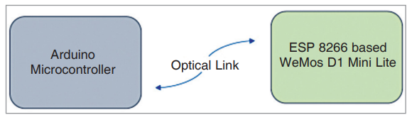

# LiFi Communication System

## Overview

This project implements a Light Fidelity (LiFi) communication system that can be implemented using any microcontroller platform including ESP8266/ESP32, Arduino, Raspberry Pi, STM32, or other development boards. LiFi is a wireless communication technology that uses visible light instead of radio waves to transmit data. This implementation demonstrates unidirectional data transmission through modulated LED light signals and photodiode reception.

**🔧 Implementation**: For this project, we used **ESP8266** and **Arduino Uno** microcontrollers to demonstrate the versatility and cross-platform compatibility of the LiFi communication protocol.

**📖 Featured Publication**: This project is featured in the **Electronics For You** monthly magazine (August 2025 edition) and will be available online soon with detailed implementation guide and technical insights.

## Table of Contents

- [Features](#features)
- [Hardware Requirements](#hardware-requirements)
- [System Architecture](#system-architecture)
- [Installation & Setup](#installation--setup)
- [Usage](#usage)
- [Technical Specifications](#technical-specifications)
- [Code Structure](#code-structure)
- [Troubleshooting](#troubleshooting)
- [Future Enhancements](#future-enhancements)
- [Contributing](#contributing)

## Features

- **Wireless Data Transmission**: Uses visible light for data communication
- **Real-time Communication**: Instant text message transmission
- **Low Latency**: Minimal delay in data transfer
- **Simple Protocol**: Easy-to-understand binary communication
- **Cost-effective**: Uses common Arduino components
- **Line-of-sight Communication**: Direct optical transmission path
- **Energy Efficient**: Low power consumption design

## Hardware Requirements

### Transmitter Side
- Any microcontroller (ESP8266/ESP32, Arduino Uno/Nano, Raspberry Pi, STM32, etc.)
- High-brightness LED (White/Blue recommended)
- 220Ω resistor (adjust based on LED specifications)
- Breadboard and jumper wires
- USB cable for programming and power

### Receiver Side
- Any microcontroller (ESP8266/ESP32, Arduino Uno/Nano, Raspberry Pi, STM32, etc.)
- Photodiode (BPW21, BPV10, or similar)
- 10kΩ pull-up resistor
- Breadboard and jumper wires
- USB cable for programming and power

**Note**: This project was successfully tested using ESP8266 (transmitter) and Arduino Uno (receiver), demonstrating cross-platform compatibility.

### Optional Components
- LED driver circuit for higher power transmission
- Amplifier circuit for photodiode sensitivity
- Optical lens for focused transmission
- Housing/enclosure for environmental protection

## System Architecture

```
[Computer] ──► [Transmitter MCU] ──► [LED] ~~~light~~~ [Photodiode] ──► [Receiver MCU] ──► [Computer]
```



### Communication Flow
1. **Input**: User types message on transmitter-connected computer
2. **Encoding**: Transmitter converts text to binary and modulates LED
3. **Transmission**: LED emits light patterns representing data bits
4. **Reception**: Photodiode detects light variations
5. **Decoding**: Receiver converts light patterns back to text
6. **Output**: Decoded message displayed on receiver-connected computer


## Installation & Setup

### 1. Hardware Assembly

#### Circuit


### 2. Software Setup

1. **Install Arduino IDE** (version 1.8.0 or higher)
2. **Connect microcontroller boards** to your computer via USB
3. **Select appropriate board and port** in Arduino IDE
4. **Upload code**:
   - Upload `TRANSMITTER_SIDE.ino` to transmitter microcontroller
   - Upload `RECEIVER_SIDE.ino` to receiver microcontroller


### 3. Environment Setup

1. **Position devices**: Ensure line-of-sight between LED and photodiode
2. **Optimal distance**: Start with 10-150cm separation
3. **Lighting conditions**: Works best in dim ambient light
4. **Alignment**: Point LED directly at photodiode for best performance

## Usage

### Basic Operation

1. **Power both systems**: Connect both microcontrollers to computers via USB
2. **Open Serial Monitors**: 
   - Transmitter: 9600 baud rate
   - Receiver: 115200 baud rate
3. **Send message**: Type text in transmitter serial monitor and press Enter
4. **Receive message**: View decoded text in receiver serial monitor

### Example Communication Session

**Transmitter Output:**
```
Transmitted Text: Hello World
Transmitted Text: LiFi is amazing!
```

**Receiver Output:**
```
Hello WorldLiFi is amazing!
```

## Technical Specifications

### Communication Protocol
- **Data Rate**: ~333 bits per second (3ms bit delay)
- **Encoding**: 8-bit ASCII character transmission
- **Start Bit**: Low signal (LED OFF)
- **Data Bits**: 8 bits per character (LSB first)
- **Stop Bit**: High signal (LED ON)
- **Error Detection**: None (basic implementation)

### Timing Parameters
- **Bit Delay**: 3 milliseconds
- **Start Bit Detection**: 1.5× bit delay offset
- **Baud Rate**: 
  - Transmitter Serial: 9600 bps
  - Receiver Serial: 115200 bps

### Signal Characteristics
- **Modulation**: On-Off Keying (OOK)
- **Logic Levels**: 
  - '1': LED ON (High intensity)
  - '0': LED OFF (Low/No intensity)
- **Idle State**: LED ON (ready for transmission)

## Code Structure

### Transmitter Side (`TRANSMITTER_SIDE.ino`)

#### Key Functions:
- `setup()`: Initializes LED pin and serial communication
- `loop()`: Continuously monitors for input and transmits data
- `transmitString()`: Handles string transmission character by character
- `transmit_byte()`: Transmits individual characters using bit manipulation

#### Core Logic:
```cpp
// Start bit (LED OFF)
digitalWrite(LED_PIN, LOW);

// Data bits (8-bit character)
for (int i = 0; i < 8; i++) {
    digitalWrite(LED_PIN, (byte & (1 << i)) != 0);
    delay(BITDELAY);
}

// Stop bit (LED ON)
digitalWrite(LED_PIN, HIGH);
```

### Receiver Side (`RECEIVER_SIDE.ino`)

#### Key Functions:
- `setup()`: Initializes serial communication
- `loop()`: Monitors for start bit and decodes incoming data
- `get_bit()`: Reads photodiode state and converts to binary
- `get_byte()`: Assembles 8 bits into complete character

#### Core Logic:
```cpp
// Detect start bit (falling edge)
if (!current_state && previous_state) {
    // Read 8 data bits
    for (int i = 0; i < 8; i++) {
        byte = byte | (get_bit() << i);
    }
}
```

## Troubleshooting

### Common Issues

#### No Data Reception
- **Check connections**: Verify photodiode and LED wiring
- **Alignment**: Ensure LED points directly at photodiode
- **Distance**: Move devices closer (< 30cm initially)
- **Ambient light**: Reduce room lighting

#### Garbled/Incorrect Data
- **Timing issues**: Verify BITDELAY values match
- **Signal strength**: Increase LED brightness or reduce distance
- **Interference**: Shield from other light sources
- **Serial monitor**: Check baud rate settings

#### Intermittent Communication
- **Power supply**: Ensure stable power to both microcontrollers
- **Connections**: Check for loose wires
- **Environmental**: Avoid vibrations affecting alignment

### Performance Optimization

1. **Increase LED brightness**: Use higher current (with appropriate resistor)
2. **Improve photodiode sensitivity**: Add amplification circuit
3. **Optimize timing**: Fine-tune BITDELAY for your setup
4. **Add error correction**: Implement checksums or parity bits
5. **Use focused optics**: Add lenses for longer distance communication

## Future Enhancements

### Short-term Improvements
- [ ] Add error detection and correction
- [ ] Implement bidirectional communication
- [ ] Variable data rate support
- [ ] Message acknowledgment system
- [ ] GUI interface for easier operation

### Advanced Features
- [ ] Multiple channel support (RGB LED)
- [ ] Encryption for secure communication
- [ ] Network protocol implementation (TCP/IP over LiFi)
- [ ] Mobile app integration
- [ ] Real-time video streaming
- [ ] IoT device integration

### Hardware Upgrades
- [ ] High-power LED arrays
- [ ] Avalanche photodiode receivers
- [ ] Optical amplifiers and filters
- [ ] Automatic alignment systems
- [ ] Weather-resistant enclosures

## Technical Background

### LiFi Technology Benefits
- **Security**: Light cannot penetrate walls, providing inherent security
- **Bandwidth**: Visible light spectrum offers vast bandwidth potential
- **Interference-free**: No electromagnetic interference with radio systems
- **Energy efficient**: Can utilize existing LED lighting infrastructure
- **Safe**: No radiation concerns unlike RF communication

### Applications
- **IoT Data Transmission**: Sensor data collection in smart buildings and industrial automation
- **Smart Street Lighting**: Using existing LED street lights as data transmission nodes for smart city infrastructure
- **Mountain/Remote Area Communication**: Long-distance data transfer using high-power laser diodes for areas without cellular coverage
- **Radio Frequency Alternative**: RF-free zones like hospitals, aircraft, and sensitive electronic environments
- **Indoor Navigation**: Precise positioning systems using ceiling-mounted LED transmitters
- **Secure Communications**: Military, banking, and government applications requiring contained data transmission
- **Underwater Communication**: Submersible vehicles and underwater research where RF signals fail
- **Medical Devices**: Safe communication in MRI rooms and other electromagnetically sensitive medical environments


## Contributing

We welcome contributions to improve this LiFi communication system!

### How to Contribute
1. **Fork** the repository
2. **Create** a feature branch (`git checkout -b feature/AmazingFeature`)
3. **Commit** your changes (`git commit -m 'Add some AmazingFeature'`)
4. **Push** to the branch (`git push origin feature/AmazingFeature`)
5. **Open** a Pull Request

### Areas for Contribution
- Code optimization and bug fixes
- Hardware design improvements
- Documentation enhancements
- Testing and validation
- New feature development

### Coding Standards
- Follow Arduino IDE coding conventions
- Comment complex algorithms clearly
- Test all changes before submitting
- Update documentation for new features

## License

This project is licensed under the MIT License - see the [LICENSE](LICENSE) file for details.

## Acknowledgments

- Arduino community for excellent documentation and examples
- Open-source LiFi research community
- **Electronics For You** magazine for featuring this project in their August 2025 edition


**🎓 Special gratitude to Dr. Geetali Saha**, Electronics & Communication Department, Government College of Engineering and Technology (GCET), for her invaluable mentorship, technical guidance, and continuous support throughout this project development.

**Note**: This is an educational/experimental implementation. For production use, consider professional LiFi solutions with proper error handling, security, and regulatory compliance.

